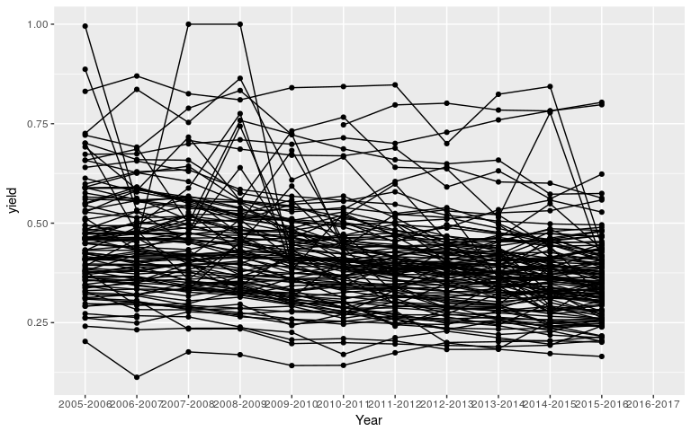

colleges
================

[](https://travis-ci.org/beanumber/colleges)

Data about colleges
-------------------

``` r
devtools::install_github("beanumber/colleges")
```

``` r
library(tidyverse)
library(colleges)
ncaa %>%
  group_by(Year) %>%
  summarize(N = n(),
            num_bball_teams = sum(!is.na(bball_wins)),
            num_fball_teams = sum(!is.na(fball_wins)),
            num_bball_no_fball = sum(!is.na(bball_wins) & is.na(fball_wins)),
            num_fball_no_bball = sum(is.na(bball_wins) & !is.na(fball_wins)),
            bball_wins = sum(bball_wins, na.rm = TRUE), bball_losses = sum(bball_losses, na.rm = TRUE),
            fball_wins = sum(fball_wins, na.rm = TRUE), fball_losses = sum(fball_losses, na.rm = TRUE),
            bball_champs = sum(bb_champs, na.rm = TRUE), fball_champs = sum(fb_champs, na.rm = TRUE),
            bb_champs = max(ifelse(bb_champs, school_name, "")),
            fb_champs = max(ifelse(fb_champs, school_name, ""), na.rm = TRUE),
            enrolled = sum(enrolled, na.rm = TRUE),
            admitted = sum(admitted, na.rm = TRUE),
            applied = sum(applied, na.rm = TRUE),
            act_composite_75 = mean(act_composite_75, na.rm = TRUE),
            sat_75 = mean(sat_75_avg, na.rm = TRUE)) %>%
  mutate(admit_rate = admitted / applied,
         yield = enrolled / admitted)
```

    ## # A tibble: 12 x 21
    ##         Year     N num_bball_teams num_fball_teams num_bball_no_fball
    ##        <chr> <int>           <int>           <int>              <int>
    ##  1 2005-2006   326             326             119                207
    ##  2 2006-2007   325             325             119                206
    ##  3 2007-2008   328             328             120                208
    ##  4 2008-2009   330             330             120                210
    ##  5 2009-2010   334             334             120                214
    ##  6 2010-2011   345             345             120                225
    ##  7 2011-2012   344             344             120                224
    ##  8 2012-2013   347             347             124                223
    ##  9 2013-2014   351             351             125                226
    ## 10 2014-2015   351             351             128                223
    ## 11 2015-2016   351             351             128                223
    ## 12 2016-2017   351             351             128                223
    ## # ... with 16 more variables: num_fball_no_bball <int>, bball_wins <dbl>,
    ## #   bball_losses <dbl>, fball_wins <dbl>, fball_losses <dbl>,
    ## #   bball_champs <int>, fball_champs <int>, bb_champs <chr>,
    ## #   fb_champs <chr>, enrolled <int>, admitted <int>, applied <int>,
    ## #   act_composite_75 <dbl>, sat_75 <dbl>, admit_rate <dbl>, yield <dbl>

``` r
ggplot(ncaa, aes(x = Year, y = yield, group = school_name)) + 
  geom_point() + geom_line()
```

    ## Warning: Removed 2808 rows containing missing values (geom_point).

    ## Warning: Removed 234 rows containing missing values (geom_path).


